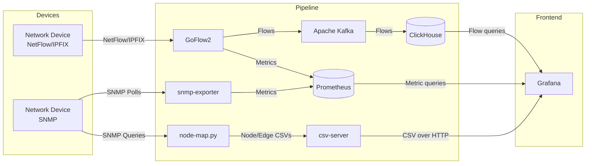
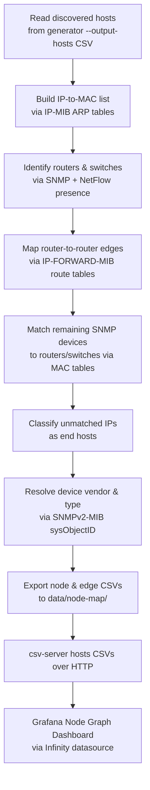

<div align="center">

# Network Segmentation Visualizer

[](https://github.com/netsampler/goflow2)
[](https://grafana.com)
[](https://prometheus.io)
[](https://clickhouse.com)
[](https://kafka.apache.org)
[](https://www.docker.com)

A web-based network segmentation visualizer that collects SNMP and NetFlow/IPFIX data from network devices, processes it through a real-time data pipeline, and presents dashboards for monitoring traffic, device performance, interface state, and network topology.

---

### PoC Video Presentation

[](https://youtu.be/KgqnY0qPfxs)

---

</div>

## Contributors

| Name | Email |
|---|---|
| Andrew Russel | russela@sheridancollege.ca |
| Edwin Downton | downtone@sheridancollege.ca |
| Sameer Haque | haqusame@sheridancollege.ca |
| Taha Siraj | sirajt@sheridancollege.ca |

---

## Overview

The visualizer maps out a network and collects metrics including device performance and load, bandwidth usage, interface state, open ports, and traffic flow. It surfaces insights such as high-load alerts on routers, traffic anomalies, and segmentation issues.

Data is collected over two parallel pipelines:

- **NetFlow/IPFIX pipeline:** GoFlow2 collects flow data from devices and publishes it to both Prometheus and Apache Kafka. Kafka forwards the data to ClickHouse for long-term storage.
- **SNMP pipeline:** snmp-exporter polls devices over SNMP and exposes metrics for Prometheus to scrape.

Grafana queries both ClickHouse and Prometheus to render dashboards for the end user, including alerting on vulnerable protocols and unusual port/transport activity, and a live network topology view via the Node Map.

---

## Architecture



All components are containerized and managed with Docker Compose.

---

## Stack

| Component | Role |
|---|---|
| Grafana | Front-end dashboards, alerting, node graph |
| Prometheus | Time-series metrics database |
| ClickHouse | Columnar database for flow records |
| Apache Kafka | Stream processing broker |
| GoFlow2 | IPFIX / NetFlow / sFlow collector |
| snmp-exporter | SNMP collector and Prometheus exporter |
| node-map.py | Topology discovery script, writes node/edge CSVs |
| csv-server | Lightweight HTTP service hosting node map CSVs for Grafana (via Infinity datasource) |
| Docker Compose | Container orchestration |

---

## Getting Started

### Prerequisites

- Docker and Docker Compose (run as root or with `sudo`)
- A network device configured to send NetFlow/IPFIX to the host running GoFlow2
- SNMP enabled on target devices (community string required)
- Python 3 with `python-nmap`, `snimpy`, and `PyYAML` for the configuration generator

### Setup

1. Clone the repository.
2. Run the configuration generator (see [Configuration Generator](#configuration-generator)) to produce a Prometheus scrape config and a node map host list for your SNMP targets.
3. Bring up the stack:

```bash
sudo docker compose up
```

> **Note:** GoFlow2 will log connection errors for ~15–20 seconds on startup while Kafka initializes. This is expected — GoFlow2 will reconnect automatically once Kafka is ready.

4. Access Grafana at `http://localhost:3000`. The default credentials can be set in the Compose environment.

A full step-by-step installation walkthrough for Debian-based hosts is available at [`docs/install-debian.md`](docs/install-debian.md).

---

## Configuration Generator

The generator is a Python 3 script (`generator/generator.py`) that scans the local network for SNMP-capable devices and produces both a Prometheus scrape configuration and a node map host list. Run it during initial setup, or rerun it whenever the network's SNMP configuration changes.

**Dependencies:** `python-nmap`, `snimpy`, `PyYAML`

MIB files needed for parsing are now bundled with the project under `generator/mibs/`, so no separate manual MIB installation is required to run the generator itself.

### Usage

```
python3 generator/generator.py --help
usage: generator.py [-h] [--auth AUTH] [--network NETWORK] [--community COMMUNITY]
                    [--version VERSION] [--output OUTPUT] [--output-hosts OUTPUT_HOSTS]

Generates Prometheus configuration for Network Segmentation Visualizer

options:
  -h, --help            show this help message and exit
  --auth AUTH           snmp-exporter auth module to use for Prometheus (default: public_v2)
  --network NETWORK     Network to scan in CIDR notation
  --community COMMUNITY
                        SNMP community to scan (default: public)
  --version VERSION     SNMP version to use for scan (default: 2)
  --output OUTPUT       Output file (default: ./config/prometheus/prometheus.yml)
  --output-hosts OUTPUT_HOSTS
                        Output CSV of discovered hosts for the node map (default: ./data/node-map/hosts.csv)

For further details check the README
```

### How it works

1. Determines the local `/24` subnet (or uses the value from `--network`).
2. Uses `nmap` to scan for hosts with UDP port 161 (SNMP) open.
3. Queries each host via SNMP to read `sysObjectID`, `sysDescr`, and `sysName`.
4. Detects device vendor using the sysObjectID OID prefix and/or keywords in `sysDescr`.
5. Selects vendor-appropriate SNMP MIB modules for the scrape job.
6. Writes a `prometheus.yml` to `<output>/prometheus/prometheus.yml`.
7. Writes a discovered-hosts CSV to `<output-hosts>`, which `node-map.py` consumes as its device seed list.

### Vendor detection

The generator currently recognises the following vendors automatically:

| Vendor | Detection method | Extra MIB modules |
|---|---|---|
| OpenWRT | sysObjectID prefix `.1.3.6.1.4.1.8072.` or keywords in sysDescr | `ip_mib`, `ucd_system_stats`, `ucd_memory` |
| Cisco | sysObjectID prefix `.1.3.6.1.4.1.9.` or keywords (`cisco`, `ios`, `catalyst`, etc.) | `cisco_device` |
| Mikrotik | sysObjectID prefix `.1.3.6.1.4.1.14988.` or keywords (`mikrotik`, `routeros`, etc.) | `mikrotik_device` |

Devices that cannot be matched to a known vendor are included in the config with base MIB modules only and are labelled `unknown`. Mixed-vendor networks are supported directly — the generator selects modules per host, so OpenWRT, Cisco, and Mikrotik devices can be scraped from a single generated config.

> **Note:** TP-Link and D-Link were evaluated as third vendor targets but have been dropped in favour of Mikrotik support, which is now fully implemented for both the config generator and `snmp-exporter`.

> Config generation and node map generation share a discovery pass but write separate outputs (`--output` and `--output-hosts`) so they can be consumed independently by Prometheus and `node-map.py`.

For detailed instructions on generating the `snmp-exporter` vendor config (`snmp.yml`) for OpenWRT, Cisco, or Mikrotik, see [`docs/snmp/README.md`](docs/snmp/README.md). Example generator configs are provided for each: `generator-openwrt-example.yml`, `generator-cisco-example.yml`, and `generator-mikrotik-example.yml`.

---

## SNMP MIBs

The following standard MIBs are used for device and interface data collection. Vendor-specific MIBs are added on a per-vendor basis as described in the [Configuration Generator](#configuration-generator) section above.

| MIB | Purpose |
|---|---|
| IF-MIB | Interface addresses, traffic totals, naming |
| SNMPv2-MIB | SNMP system information |
| HOST-RESOURCES-MIB | CPU and storage utilization |
| IP-FORWARD-MIB | IP routing/forwarding tables |
| IP-MIB | ARP tables, IP addressing |
| RFC1213-MIB | MAC, TCP, ICMP, listening ports |
| UDP-MIB | UDP usage statistics |
| BRIDGE-MIB | MAC forwarding tables (switches; Cisco only — see note below) |
| CISCO-IF-EXTENSION-MIB | Additional interface info (Cisco devices) |

> **Note:** `BRIDGE-MIB` is included in the Cisco and OpenWRT module sets but has been removed from the Mikrotik `extra_modules` list — RouterOS's implementation was unreliable enough during testing that it was dropped rather than worked around, and Mikrotik edge data is instead derived from ARP/routing tables like OpenWRT.

---

## Node Map

The node map reconstructs network topology by correlating ARP tables, routing tables, MAC forwarding tables, and SNMP device identity data. It is now a working, standalone pipeline stage (`node-map.py`) that runs independently of Prometheus/snmp-exporter and integrates directly with the output of the configuration generator.



### Pipeline details

- **`node-map.py`** now consumes the host list produced by `generator/generator.py --output-hosts`, rather than needing to be run against a separately maintained device list.
- Output changed from a Python data structure to **CSV**, written into dedicated `data/node-map/nodes/` and `data/node-map/edges/` folders. These CSV files are git-ignored, since they're environment-specific runtime output.
- A dedicated **`csv-server`** Docker Compose service hosts these CSVs and exposes them over HTTP so Grafana's **Infinity datasource** can query them directly, feeding the **Node Graph** panel with static UIDs for stable dashboard links.
- The Dockerfile for the node map component now runs `node-map.py` as its sole `CMD`, matching its role as a standalone service.
- A **NodeMap Dashboard** has been added to Grafana, and edges are now rendered alongside nodes (previously nodes-only).

> **Note:** BRIDGE-MIB availability still varies by vendor — see the [SNMP MIBs](#snmp-mibs) section. Where BRIDGE-MIB data isn't available (OpenWRT, Mikrotik), the node map falls back to ARP- and routing-table-derived edges; devices that can't be placed via those tables are still shown as unconnected nodes rather than being dropped.

---

## Alerting

Grafana alerting rules have been added covering:

- Vulnerable/insecure protocol usage (e.g. plaintext management protocols) observed in flow data.
- Unusual TCP ports, UDP ports, and transport protocols relative to expected baseline traffic.

Alerting rule provisioning files live alongside the rest of the Grafana config and use static UIDs so that dashboard/alert links remain stable across restarts and config reloads.

---

## Dashboards

Grafana dashboards have been reorganized and expanded. Current dashboards include:

- **Overview** — high-level device and traffic summary, now including IP-FORWARD-MIB routing information.
- **ClickHouse Flows** — NetFlow/IPFIX flow data queried directly from ClickHouse.
- **HR (Host Resources)** — CPU, memory, and storage utilization via HOST-RESOURCES-MIB.
- **NodeMap** — network topology graph (nodes + edges) served from the `csv-server` via the Infinity datasource.

All Grafana datasources are now provisioned with static UIDs to keep dashboard references stable across rebuilds.

---

## Supported Vendors

| Vendor | Status |
|---|---|
| OpenWRT |  Supported (PoC) |
| Cisco |  Supported — config generator + working `snmp-exporter` config, tested in GNS3 |
| Mikrotik |  Supported — config generator + `snmp-exporter` config added |
| TP-Link |  Dropped in favour of Mikrotik |
| D-Link |  Dropped in favour of Mikrotik |

---

## Testing Setup

See [`docs/vbox-test-setup/README.md`](docs/vbox-test-setup/README.md) for instructions on setting up a local test environment with Oracle VirtualBox using OpenWRT as the router and Debian VMs as clients.

A GNS3-based testing environment for Cisco devices was used to validate Cisco support; see `docs/gns3-test-setup/`.

A full Debian installation walkthrough is available at [`docs/install-debian.md`](docs/install-debian.md).

---

## Changelog

### July 2026

- **Node map now integrated with the configuration generator** — `node-map.py` reads its host list directly from the generator's `--output-hosts` CSV instead of a separately maintained list, and node/edge output was switched from a Python data structure to CSV.
- **Alerting for vulnerable protocols and unusual ports** — new Grafana alerting rules flag vulnerable protocol usage and unusual TCP/UDP ports or transport protocols in flow data.
- **Grafana dashboards reorganized** — dashboards regrouped for clarity as the number of panels/data sources has grown (Overview, ClickHouse Flows, HR, NodeMap).
- **Mikrotik support added** end-to-end: configuration generator vendor detection, dedicated `snmp-exporter` config, and a mixed-vendor `snmp-exporter` configuration for networks running more than one supported vendor. `bridge_mib` was subsequently removed from Mikrotik's `extra_modules` after proving unreliable on RouterOS.
- **Node map output pipeline finalized** — dedicated CSV output folders added, CSVs added to `.gitignore`, a `csv-server` Compose service added to host the CSVs, and the node map Dockerfile's `CMD` updated to run `node-map.py` directly.
- **NodeMap Dashboard added to Grafana**, with edges now rendered (previous iterations were nodes-only).
- **Configuration generator now bundles required MIB files** with the project rather than expecting them to be installed separately.
- **Debian installation walkthrough added** (`docs/install-debian.md`), plus NetFlow setup documentation and a related typo fix.
- **compose.yml cleanup** — fixed a configuration typo in the node-map service definition and removed unnecessary lines.

### June 2026 (Phase 2)

- **Cisco support completed** — working `snmp-exporter` config for Cisco added and validated ([issue #5](https://github.com/Sameer-Haque/Network-Segmentation-Visualizer/issues/5)), following on from the experimental `generator-cisco-example.yml` added in mid-June.
- **D-Link `snmp-exporter` modules created** as a candidate third vendor, then dropped in favour of Mikrotik (see July changes above).
- **Node map made functional** — early working versions of node/edge generation and Grafana Node Graph integration landed, including an Infinity datasource for CSV-backed panels.
- **Grafana Alerting configuration added** ([issue #10](https://github.com/Sameer-Haque/Network-Segmentation-Visualizer/issues/10)), with static UIDs added to alerting rules and datasources for stability across reloads. `grafana.ini` relocated to a more accessible path for configuration changes.
- **ClickHouse Flows and HR dashboards added**; IP-FORWARD-MIB routing information added to the Overview dashboard.
- **OpenWRT IP-MIB / IP-FORWARD-MIB testing support added**, along with related fixes.
- **Configuration generator shipped** — `generator/generator.py` performs a live `nmap` scan, queries each discovered host via SNMP, auto-detects vendor from sysObjectID and sysDescr, and writes a ready-to-use `prometheus.yml`. Later extended to also dump discovered device info to a separate file and then to CSV output for node map consumption.
- **snmp-exporter vendor config documentation added** — `docs/snmp/README.md` provides a full walkthrough for generating `snmp.yml`, including MIB extraction, generator compilation, config authoring, and debugging. Example `generator.yml` files added for OpenWRT and Cisco.
- **Configuration generator README added** (`generator/README.md`) documenting CLI usage.
- **Generator network detection hardened** — `get_local_network()` now uses a safe dummy address (`192.0.2.1`) rather than a live routable destination to determine the local IP.
- **Node map CSV service added** — a dedicated Docker service now hosts the node map CSV files and exposes them to Grafana's Node Graph panel (later superseded by the dedicated `csv-server` service in July, see above).

### May 2026 (Phase 1 — PoC)

- Initial PoC released: GoFlow2 → Kafka → ClickHouse → Grafana pipeline operational.
- SNMP data collection via snmp-exporter integrated into Prometheus.
- Node map design completed: ARP + routing + MAC table correlation approach finalised.
- SNMP information-gathering script completed.
- VirtualBox-based test environment documented and `.ova` shipped.

---

<details>
<summary><strong>Known Issues</strong></summary>

### Grafana fails to start — permission denied on `/var/lib/grafana`

The file permissions on `config/grafana/lib/` may be incorrect. Fix:

```bash
chmod -Rv a+w config/grafana/lib
```

### GoFlow2 restarts repeatedly after `docker compose up`

GoFlow2 needs Kafka to be ready before it can connect. Kafka takes ~15–20 seconds to start, so GoFlow2 will error and restart a few times. This is normal — it will connect automatically once Kafka is up. Seeing 5–6 `connection refused for kafka transport` messages in the GoFlow2 logs is expected.

### Permission denied connecting to Docker socket

Docker requires root. Use `sudo docker compose up` or ensure your user is in the `docker` group.

### NetFlow `template_not_found` errors

This happens after a restart because GoFlow2 needs to reacquire NetFlow v9 templates from the sending device. OpenWRT's `softflowd` sends templates periodically; you can force an immediate resend with:

```bash
softflowctl send-template
```

### Node map missing BRIDGE-MIB-derived edges on OpenWRT and Mikrotik

BRIDGE-MIB is not reliably available on OpenWRT by default and was removed from the Mikrotik module set after proving unreliable on RouterOS. On both platforms, the node map falls back to ARP- and routing-table-derived edges. Devices that can't be placed via those tables still appear as unconnected nodes rather than being dropped from the map.

</details>

---

## References

[1] GoFlow2 — https://github.com/netsampler/goflow2  
[2] Prometheus snmp_exporter — https://github.com/prometheus/snmp_exporter  
[3] ClickHouse Docs — https://clickhouse.com/docs  
[4] Grafana Docs — https://grafana.com/docs/grafana/latest/  
[5] Apache Kafka — https://kafka.apache.org  
[6] IPFIX Entities (IANA) — https://www.iana.org/assignments/ipfix/ipfix.xhtml  
[7] PyYAML — https://pypi.org/project/PyYAML/  
[8] python-nmap — https://pypi.org/project/python3-nmap/  
[9] snimpy — https://pypi.org/project/snimpy/
