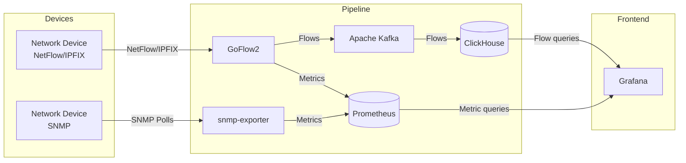
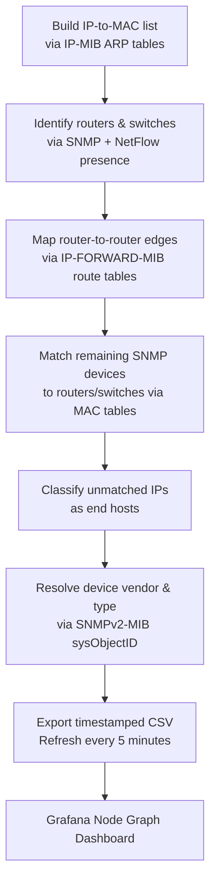

<div align="center">

# Network Segmentation Visualizer

[](https://github.com/netsampler/goflow2)
[](https://grafana.com)
[](https://prometheus.io)
[](https://clickhouse.com)
[](https://kafka.apache.org)
[](https://www.docker.com)

A web-based network segmentation visualizer that collects SNMP and NetFlow/IPFIX data from network devices, processes it through a real-time data pipeline, and presents dashboards for monitoring traffic, device performance, interface state, and network topology.

---

### PoC Video Presentation

[](https://youtu.be/KgqnY0qPfxs)

---

</div>

## Contributors

| Name | Email |
|---|---|
| Andrew Russel | russela@sheridancollege.ca |
| Edwin Downton | downtone@sheridancollege.ca |
| Sameer Haque | haqusame@sheridancollege.ca |
| Taha Siraj | sirajt@sheridancollege.ca |

---

## Overview

The visualizer maps out a network and collects metrics including device performance and load, bandwidth usage, interface state, open ports, and traffic flow. It surfaces insights such as high-load alerts on routers, traffic anomalies, and segmentation issues.

Data is collected over two parallel pipelines:

- **NetFlow/IPFIX pipeline:** GoFlow2 collects flow data from devices and publishes it to both Prometheus and Apache Kafka. Kafka forwards the data to ClickHouse for long-term storage.
- **SNMP pipeline:** snmp-exporter polls devices over SNMP and exposes metrics for Prometheus to scrape.

Grafana queries both ClickHouse and Prometheus to render dashboards for the end user.

---

## Architecture



All components are containerized and managed with Docker Compose.

---

## Stack

| Component | Role |
|---|---|
| Grafana | Front-end dashboards |
| Prometheus | Time-series metrics database |
| ClickHouse | Columnar database for flow records |
| Apache Kafka | Stream processing broker |
| GoFlow2 | IPFIX / NetFlow / sFlow collector |
| snmp-exporter | SNMP collector and Prometheus exporter |
| Docker Compose | Container orchestration |

---

## Getting Started

### Prerequisites

- Docker and Docker Compose (run as root or with `sudo`)
- A network device configured to send NetFlow/IPFIX to the host running GoFlow2
- SNMP enabled on target devices (community string required)
- Python 3 with `python-nmap`, `snimpy`, and `PyYAML` for the configuration generator

### Setup

1. Clone the repository.
2. Run the configuration generator (see [Configuration Generator](#configuration-generator)) to produce a Prometheus scrape config for your SNMP targets.
3. Bring up the stack:

```bash
sudo docker compose up
```

> **Note:** GoFlow2 will log connection errors for ~15–20 seconds on startup while Kafka initializes. This is expected — GoFlow2 will reconnect automatically once Kafka is ready.

4. Access Grafana at `http://localhost:3000`. The default credentials can be set in the Compose environment.

---

## Configuration Generator

The generator is a Python 3 script (`generator/generator.py`) that scans the local network for SNMP-capable devices and produces a Prometheus scrape configuration targeting those devices. Run it during initial setup, or rerun it whenever the network's SNMP configuration changes.

**Dependencies:** `python-nmap`, `snimpy`, `PyYAML`

### Usage

```
python3 generator/generator.py --help
usage: generator.py [-h] [--auth AUTH] [--network NETWORK] [--community COMMUNITY]
                    [--version VERSION] [--output OUTPUT]

Generates Prometheus configuration for Network Segmentation Visualizer

options:
  -h, --help            show this help message and exit
  --auth AUTH           snmp-exporter auth module to use for Prometheus (default: public_v2)
  --network NETWORK     Network to scan in CIDR notation
  --community COMMUNITY
                        SNMP community to scan (default: public)
  --version VERSION     SNMP version to use for scan (default: 2)
  --output OUTPUT       Output file (default: ./config/prometheus/prometheus.yml)

For further details check the README
```

### How it works

1. Determines the local `/24` subnet (or uses the value from `--network`).
2. Uses `nmap` to scan for hosts with UDP port 161 (SNMP) open.
3. Queries each host via SNMP to read `sysObjectID`, `sysDescr`, and `sysName`.
4. Detects device vendor using the sysObjectID OID prefix and/or keywords in `sysDescr`.
5. Selects vendor-appropriate SNMP MIB modules for the scrape job.
6. Writes a `prometheus.yml` to `<output>/prometheus/prometheus.yml`.

### Vendor detection

The generator currently recognises three vendors automatically:

| Vendor | Detection method | Extra MIB modules |
|---|---|---|
| OpenWRT | sysObjectID prefix `.1.3.6.1.4.1.8072.` or keywords in sysDescr | `ip_mib`, `ucd_system_stats`, `ucd_memory` |
| Cisco | sysObjectID prefix `.1.3.6.1.4.1.9.` or keywords (`cisco`, `ios`, `catalyst`, etc.) | `cisco_device` |
| TP-Link | sysObjectID prefix `.1.3.6.1.4.1.11863.` or keywords (`tp-link`, `archer`, etc.) | `ip_mib` |

Devices that cannot be matched to a known vendor are included in the config with base MIB modules only and are labelled `unknown`.

> Config generation and node map generation are intentionally kept separate for modularity. The generator only handles Prometheus targets; node map state is managed independently.

For detailed instructions on generating the `snmp-exporter` vendor config (`snmp.yml`) for OpenWRT or other vendors, see [`docs/snmp/README.md`](docs/snmp/README.md).

---

## SNMP MIBs

The following standard MIBs are used for device and interface data collection. Vendor-specific MIBs are added on a per-vendor basis as described in the [Configuration Generator](#configuration-generator) section above.

| MIB | Purpose |
|---|---|
| IF-MIB | Interface addresses, traffic totals, naming |
| SNMPv2-MIB | SNMP system information |
| HOST-RESOURCES-MIB | CPU and storage utilization |
| IP-FORWARD-MIB | IP routing/forwarding tables |
| IP-MIB | ARP tables, IP addressing |
| RFC1213-MIB | MAC, TCP, ICMP, listening ports |
| UDP-MIB | UDP usage statistics |
| BRIDGE-MIB | MAC forwarding tables (switches) |
| CISCO-IF-EXTENSION-MIB | Additional interface info (Cisco devices) |

---

## Node Map

The node map reconstructs network topology by correlating ARP tables, routing tables, MAC forwarding tables, and SNMP device identity data.



> **Note:** OpenWRT does not fully implement BRIDGE-MIB (`.1.3.6.1.2.1.17.4.3.1`) by default, which delays edge generation in the node map for OpenWRT-only environments. Development is continuing on a workaround for this; Cisco environments are unaffected as BRIDGE-MIB is fully supported there.

---

## Supported Vendors

| Vendor | Status |
|---|---|
| OpenWRT | ✅ Supported (PoC) |
| Cisco | 🔄 In progress (Phase 2) |
| TP-Link | 🔄 In progress (Phase 2) Note: Will very likely be swapped out in favor of D-Link |

---

## Testing Setup

See [`docs/vbox-test-setup/README.md`](docs/vbox-test-setup/README.md) for instructions on setting up a local test environment with Oracle VirtualBox using OpenWRT as the router and Debian VMs as clients.

A GNS3-based testing environment for Cisco devices is in progress as part of Phase 2.

---

## Changelog

### June 2026 (Phase 2 — in progress)

- **Configuration generator shipped** — `generator/generator.py` now performs a live `nmap` scan, queries each discovered host via SNMP, auto-detects vendor from sysObjectID and sysDescr, and writes a ready-to-use `prometheus.yml`. Supported vendors: OpenWRT, Cisco, TP-Link. ([`355a150`](../../commit/355a150), [`19aaeec`](../../commit/19aaeec))
- **snmp-exporter vendor config documentation added** — `docs/snmp/README.md` provides a full walkthrough for generating `snmp.yml` for OpenWRT, including MIB extraction, generator compilation, config authoring, and debugging. An example `generator.yml` for OpenWRT is included. ([`7dc0898`](../../commit/7dc0898), [`769fb74`](../../commit/769fb74))
- **Configuration generator README added** (`generator/README.md`) documenting CLI usage. ([`769fb74`](../../commit/769fb74))
- **Generator network detection hardened** — `get_local_network()` now uses a safe dummy address (`192.0.2.1`) rather than a live routable destination to determine the local IP. ([`355a150`](../../commit/355a150))
- **Cisco vendor support in progress** — GNS3 test environment (tahasiraj97), snmp-exporter config (ar-pbais-y4), and Cisco-specific Grafana dashboards (Sameer-Haque) are being developed in parallel. Node map testing on Cisco is also underway.
- **Node map edge generation blocked on OpenWRT BRIDGE-MIB** — BRIDGE-MIB is not fully available on OpenWRT by default; a custom workaround for OID `.1.3.6.1.2.1.17.4.3.1` is in development. Cisco-first approach adopted while workaround is built.
- **Node map CSV service added** — a dedicated Docker service now hosts the node map CSV files and exposes them to Grafana's Node Graph panel.

<details>
<summary><strong>Known Issues</strong></summary>

### Grafana fails to start — permission denied on `/var/lib/grafana`

The file permissions on `config/grafana/lib/` may be incorrect. Fix:

```bash
chmod -Rv a+w config/grafana/lib
```

### GoFlow2 restarts repeatedly after `docker compose up`

GoFlow2 needs Kafka to be ready before it can connect. Kafka takes ~15–20 seconds to start, so GoFlow2 will error and restart a few times. This is normal — it will connect automatically once Kafka is up. Seeing 5–6 `connection refused for kafka transport` messages in the GoFlow2 logs is expected.

### Permission denied connecting to Docker socket

Docker requires root. Use `sudo docker compose up` or ensure your user is in the `docker` group.

### NetFlow `template_not_found` errors

This happens after a restart because GoFlow2 needs to reacquire NetFlow v9 templates from the sending device. OpenWRT's `softflowd` sends templates periodically; you can force an immediate resend with:

```bash
softflowctl send-template
```

### Node map missing edges on OpenWRT

BRIDGE-MIB is not fully implemented on OpenWRT by default, so switch MAC table data used for edge construction is unavailable. A workaround is in development. As a temporary measure, the node map will still show all SNMP-discovered devices as nodes; edges between devices that can be resolved via routing tables will still appear.

</details>

---

## References

[1] GoFlow2 — https://github.com/netsampler/goflow2  
[2] Prometheus snmp_exporter — https://github.com/prometheus/snmp_exporter  
[3] ClickHouse Docs — https://clickhouse.com/docs  
[4] Grafana Docs — https://grafana.com/docs/grafana/latest/  
[5] Apache Kafka — https://kafka.apache.org  
[6] IPFIX Entities (IANA) — https://www.iana.org/assignments/ipfix/ipfix.xhtml  
[7] PyYAML — https://pypi.org/project/PyYAML/  
[8] python-nmap — https://pypi.org/project/python3-nmap/  
[9] snimpy — https://pypi.org/project/snimpy/
