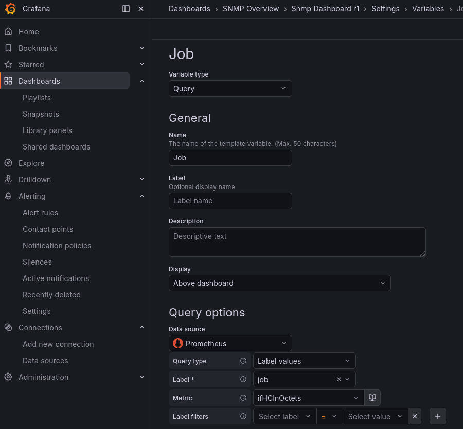
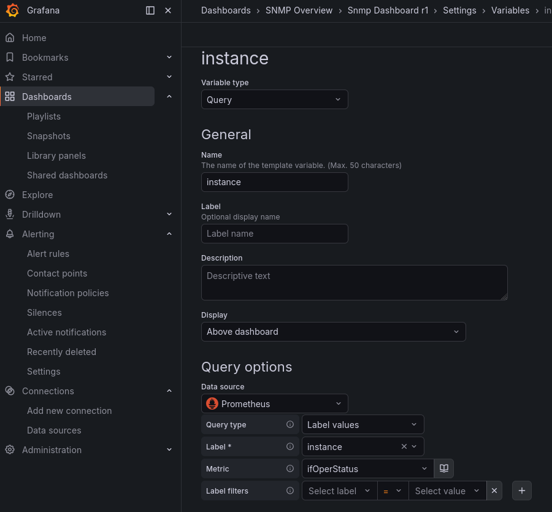
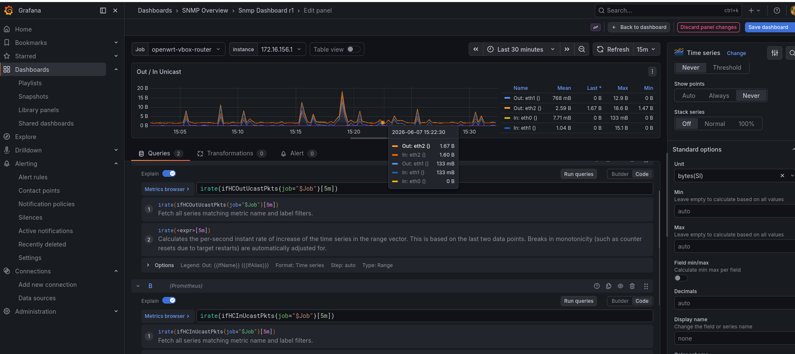

<h1> Grafana Dashboard Guide </h1>
A practical guide to creating, importing, and building dashboards in Grafana — covering data sources like ClickHouse (IPFIX), Prometheus (SNMP), and Infinity (files/APIs).

<h1>Data Sources Overview</h1>

ClickHouse — IPFIX / Flow Data
Prometheus — SNMP / Metrics
Infinity — Files & APIs

Building a Visualization with PromQL

Creating a New Dashboard

Log in to your Grafana instance.
In the left sidebar, click the dashboards option
Select "New Dashboard".

You will land on a blank dashboard canvas with a prompt to add your first panel.

Tip: Save your dashboard immediately with Ctrl+S (or Cmd+S) and give it a meaningful name before adding panels. This prevents losing work if your session expires.

Dashboard Options: Import vs Add Visualization

<h2> 1. Import Panel </h2>
Use this when: You have previously exported a single panel (as JSON) and want to bring it into your current dashboard.

Click "+ Add" → "Import panel"
Paste the panel JSON, or upload a .json file
Grafana will render the panel within your current dashboard context
You can reposition, resize, and edit the panel after import

When it's useful: Sharing individual panels across teams, or reusing a well-crafted query panel without importing an entire dashboard.

<h2>2. Import Dashboard</h2>
Use this when: You want to load a complete, pre-built dashboard — either from grafana.com/dashboards or a locally exported JSON file.

From the left sidebar: "+" → "Import"
Options:

Enter a Dashboard ID from Grafana's public library (e.g., 1860 for Node Exporter Full)
Upload a JSON file you exported from another Grafana instance
Paste JSON directly into the text area

Click "Load", select your data source(s) when prompted, then "Import"

When it's useful: Bootstrapping a standard monitoring setup quickly, or deploying dashboards from version control as part of a GitOps workflow.

<h2>3. Add Visualization</h2>
Use this when: You want to build a panel from scratch, writing your own queries and customizing the chart type.

Click "+ Add" → "Add visualization"
Select your data source (ClickHouse, Prometheus, Infinity, etc.)
Use the query editor at the bottom to write your query
Choose a visualization type in the top-right panel (Time series, Stat, Bar chart, Table, Gauge, Heatmap, etc.)
Configure Panel Options, Axes, Thresholds, Overrides, and Field settings in the right-hand sidebar
Click "Apply" (top-right) to save the panel to your dashboard

This is the most powerful and commonly used option for custom monitoring setups.

<h1> Data Sources Overview </h1>
<h2>ClickHouse — IPFIX / Flow Data</h2>
ClickHouse is a high-performance columnar database well suited for storing and querying large volumes of IPFIX (IP Flow Information Export) and NetFlow data.
Why ClickHouse for IPFIX?
IPFIX generates extremely high-cardinality, time-series flow records — millions of rows per minute in production environments. ClickHouse handles this through:

Columnar storage — only reads the columns needed for a query
MergeTree engine — optimized for time-ordered data ingestion and range queries
Aggregation at query time — GROUP BY srcIP, dstIP, port queries over billions of rows complete in seconds

<h2>Prometheus — SNMP / Metrics</h2>
Prometheus is a pull-based metrics system that scrapes targets at regular intervals and stores time-series data. It is the standard data source for SNMP-polled network metrics collected via tools like SNMP Exporter.
Why Prometheus for SNMP?
SNMP is the de facto standard for polling network device metrics (interface counters, CPU, memory, etc.). The Prometheus SNMP Exporter:

Receives scrape requests from Prometheus
Translates them into SNMP GET/WALK requests to the target device
Returns metrics in Prometheus exposition format

This gives you long-term storage, alerting, and PromQL — a powerful query language — on top of your SNMP data.

<h2>Infinity — Files & APIs</h2>
The Grafana Infinity plugin is a general-purpose data source that can query virtually any external data, including:
Source TypeExamples: REST API, JSON/XML, HTTP, endpointCSV filesStatic exports, S3-hosted files, JSON files, Config exports, enrichment data, GraphQL, GraphQL API endpoints, Google Sheets, Spreadsheets as a data source
Why use Infinity?
Infinity fills the gap when your data doesn't live in a time-series database. For example:

Pulling IP geolocation lookups from a REST API to enrich flow dashboards
Displaying device inventory from a CSV or CMDB API
Showing BGP peer tables from a router's REST API
Rendering SLA data from a ticketing system's API

Infinity does not replace a proper time-series database for high-frequency metrics, but it is invaluable for contextual, reference, or supplemental data alongside Prometheus and ClickHouse panels.

<h1> Building a Visualization with PromQL</h1>
Example: Interface Utilization
Goal: Display inbound and outbound bandwidth (in Mbps) for a specific network interface over time.

<h2> Step 1 — Create Dashboard Variables </h2>
Variables turn hardcoded values into dropdown selectors at the top of your dashboard. Create them before building panels so they're available in your queries. 
Go to your dashboard, then: Dashboard Settings (gear icon, top right) → Variables → "+ Add variable"
 
<h3> Job Variable </h3>
The job label in Prometheus identifies which scrape job collected the data. For SNMP Exporter this is typically snmp or a more specific name like snmp_routers.

This query asks Prometheus: "What are all the distinct values of the job label on the ifHCInOctets metric?" — giving you a dropdown of every SNMP scrape job present in your data. 

<h3> Instance Variable </h3>
The instance label identifies the specific device being polled (its IP or hostname). This variable depends on $job — it only shows devices belonging to the selected job.

 
The {job="$job"} filter means this dropdown automatically narrows to only the devices in whichever job is selected above. This is called a chained variable. 

Click "Update", then "Save dashboard".

<h2> Step 2 — Add a New Visualization <h2>

On your dashboard, click "+ Add" → "Add visualization" 
Select Prometheus as your data source

<h2> Step 3 — Configure the Panel <h2>
In the right-hand panel editor:

Visualization type: Time series
Panel title: Out / In Unicast
Unit (under Standard options → Unit): Mbits/sec

Add the promQL quieries 

<h2> Step 4 — Apply and Save<h2>

Click "Apply" (top right)
Press Ctrl+S to save the dashboard

<h1> Tips & Best Practices</h1>

Use dashboard variables ($device, $interface) to make panels reusable across multiple devices without duplicating dashboards. 

Template your label selectors in PromQL with variables: instance="$device" becomes a dropdown at the top of the dashboard. 

Use Grafana Alerting on Prometheus-backed panels for threshold-based notifications (interface down, high utilization, etc.). 

Export dashboards to JSON and store them in Git for version control and reproducibility. 